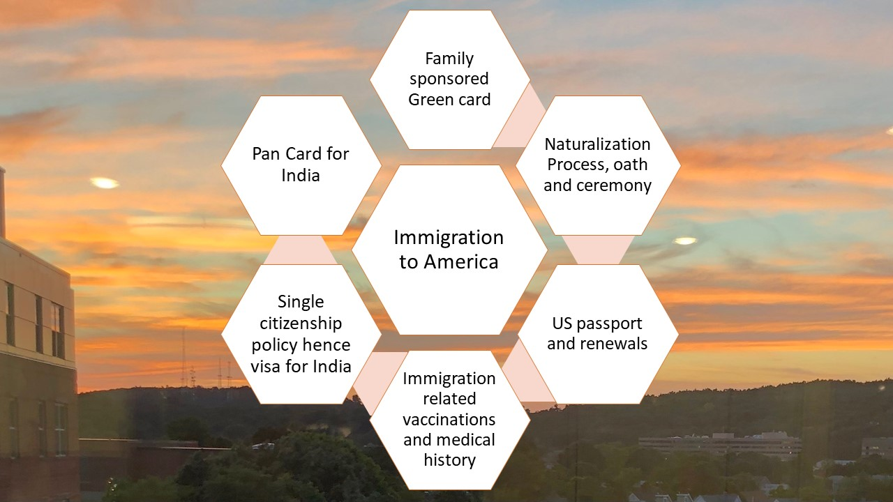

# Immigration To America

THe project provides an overview of immigration process to america

### Keeping up to date on latest news
### Student Visas
In the academic year 2020-2021 167,582  students from India on student visa (https://in.usembassy.gov/u-s-mission-in-india-issues-highest-ever-number-of-student-visas-in-2022/ Links to an external site.)  . 82000 were issued in 2022.   For China 155,000 student visas were granted from 2021-2022  

### H1B Visa
The H1B visa program is 65000 per year + 20,000 additional visas for foreign professionals who graduate with a master's degree or doctorate from a U.S. institution of higher learning (https://www.americanimmigrationcouncil.org/research/h1b-visa-program-fact-sheet#:~:text=Since%20the%20category%20was%20created,higher%20learning%20(Figure%201).  

### latest news on major changes 2020
https://www.businessbecause.com/news/mba-degree/7059/h1b-visa-changes-trump-mba

Additional details reference: https://github.com/alpaddesai/RealEstatePortfolioIdea2022
